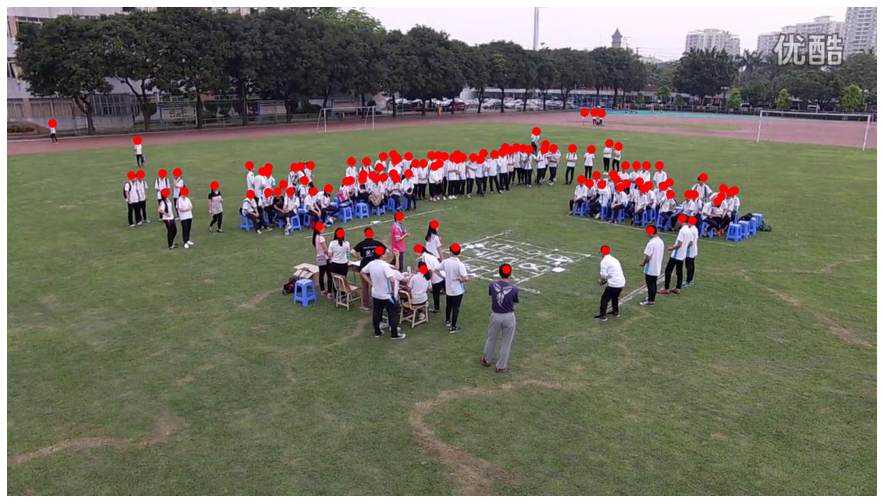
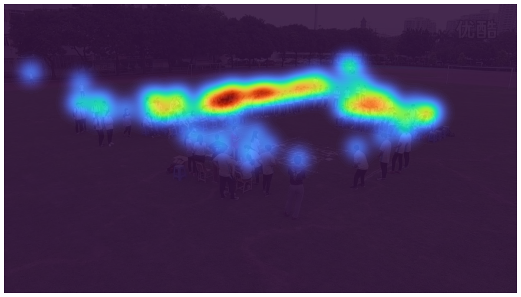
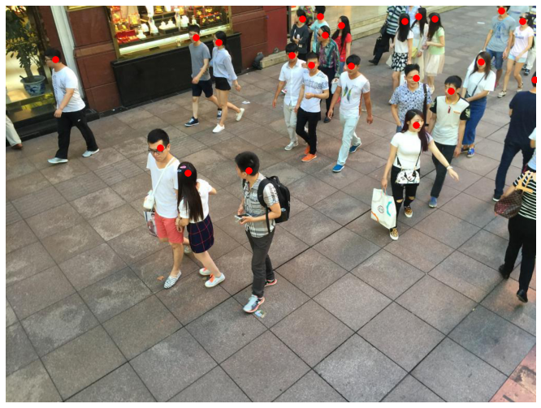
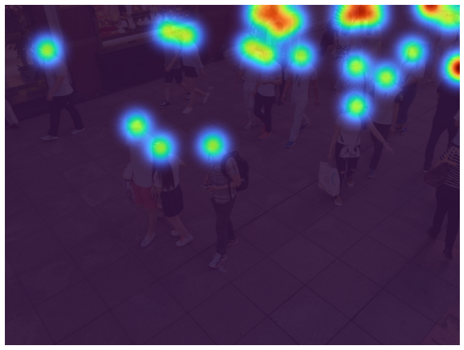

# CrowdCounting-ICC

Implementation of my MSc Individual Project at Warwick [*Inception-Based Crowd Counting*](https://warwick.ac.uk/fac/sci/mathsys/people/students/2020intake/ma/msc_individual_project/inception-based_crowd_counting.pdf).

The code for preprossing, training and evaluation can be referred to  [DM-Count](https://github.com/cvlab-stonybrook/DM-Count).

## Model Structure

## Visualisations

